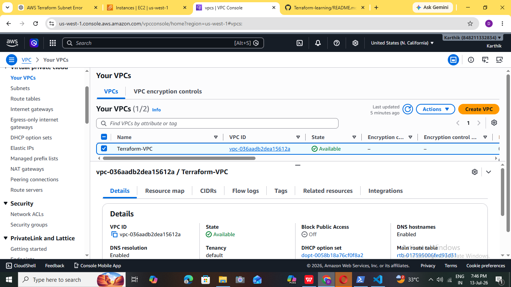
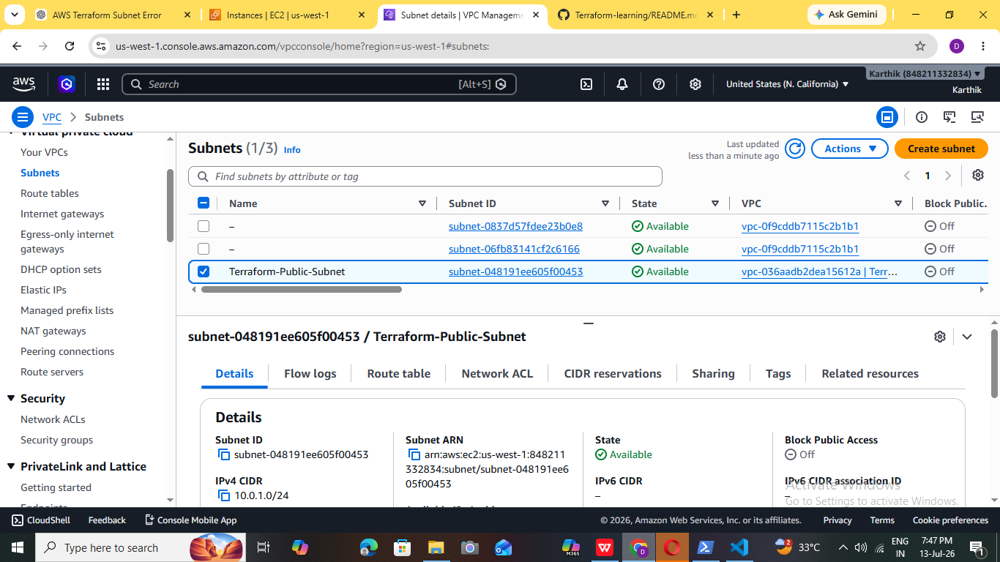
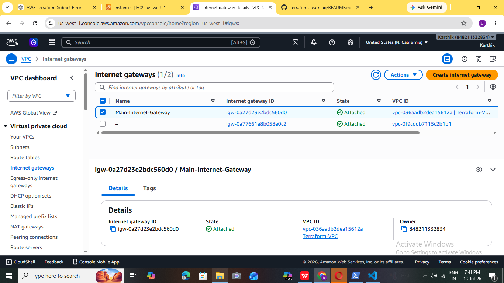
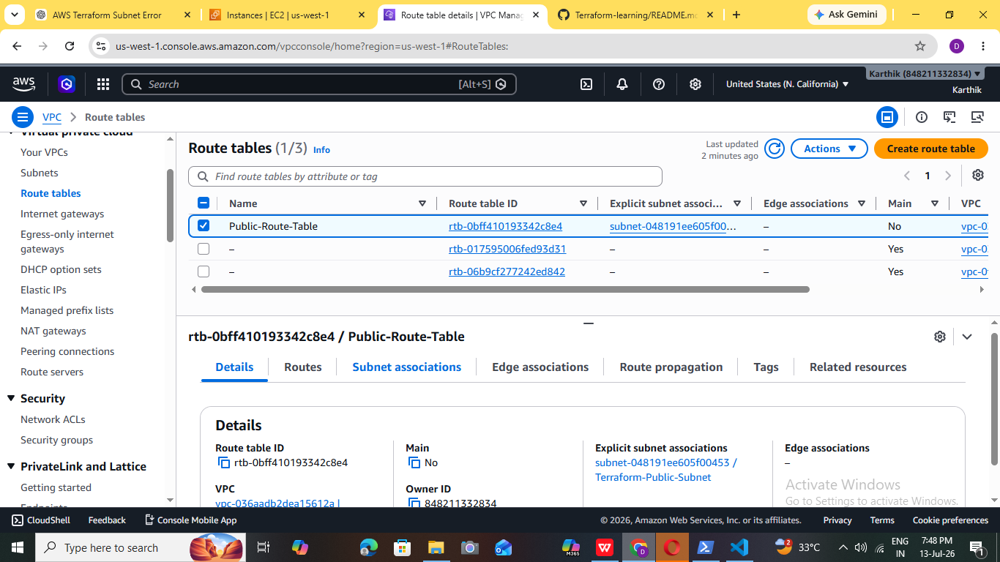
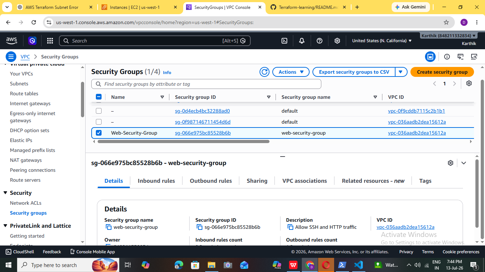

# 🚀 Terraform AWS Infrastructure Project

## 📌 Project Overview

This project demonstrates how to provision AWS infrastructure using **Terraform (Infrastructure as Code)**. The infrastructure is modularly organized into multiple Terraform configuration files for better readability and maintainability.

The project creates the following AWS resources:

* Amazon VPC
* Public Subnet
* Internet Gateway
* Route Table
* Route Table Association
* Security Group
* EC2 Instance

---

## 🛠️ Technologies Used

* Terraform
* AWS (Amazon Web Services)
* Infrastructure as Code (IaC)

---

## ☁️ AWS Services Used

* Amazon VPC
* Amazon EC2
* Amazon Subnet
* Internet Gateway
* Route Table
* Security Group

---

## 📂 Project Structure

```text
Terraform-Learning/
│── provider.tf
│── variables.tf
│── vpc.tf
│── subnet.tf
│── internet_gateway.tf
│── route_table.tf
│── security_group.tf
│── ec2.tf
│── outputs.tf
│── README.md
│── .gitignore
```

---

## 📄 Terraform Files

### provider.tf

Configures the AWS provider and region.

### variables.tf

Defines reusable input variables such as region, VPC CIDR block, subnet CIDR block, and availability zone.

### vpc.tf

Creates the Virtual Private Cloud (VPC).

### subnet.tf

Creates a public subnet inside the VPC.

### internet_gateway.tf

Creates an Internet Gateway and attaches it to the VPC.

### route_table.tf

Creates a route table, adds the default internet route, and associates it with the public subnet.

### security_group.tf

Creates a Security Group that allows:

* SSH (Port 22)
* HTTP (Port 80)
* All outbound traffic

### ec2.tf

Launches an EC2 instance inside the public subnet.

### outputs.tf

Displays useful resource information after deployment.

---

## ▶️ How to Deploy

Initialize Terraform:

```bash
terraform init
```

Validate the configuration:

```bash
terraform validate
```

Review the execution plan:

```bash
terraform plan
```

Create the infrastructure:

```bash
terraform apply
```

Destroy the infrastructure when no longer needed:

```bash
terraform destroy
```

---

## 📸 Project Screenshots

Add screenshots such as:

* Terraform Apply Output
* AWS VPC
| VPC|
|--------------|----------------|
|  |  |

* Public Subnet
| Public Subnet|
|--------------|----------------|
|  | |


* Internet Gateway
|Internet Gateway config| 
|-----------------|---------|
|  |   |
* Route Table
| Route Table|
|--------------|----------------|
|  | |


* Security Group
| Security Group |
|--------------|----------------|
|  |  |

* EC2 Instance
| EC2 Instance | Security Group |
|--------------|----------------|
|  | .png>) |

---

## 🎯 Learning Outcomes

Through this project, I learned:

* Infrastructure as Code (IaC) using Terraform
* AWS networking fundamentals
* VPC and Subnet creation
* Route Table association
* Security Group configuration
* EC2 provisioning using Terraform
* Terraform workflow (init, validate, plan, apply, destroy)

---

## 👩‍💻 Author

**Divya Viswanadhapalli**

GitHub: https://github.com/Divya-6300440034
